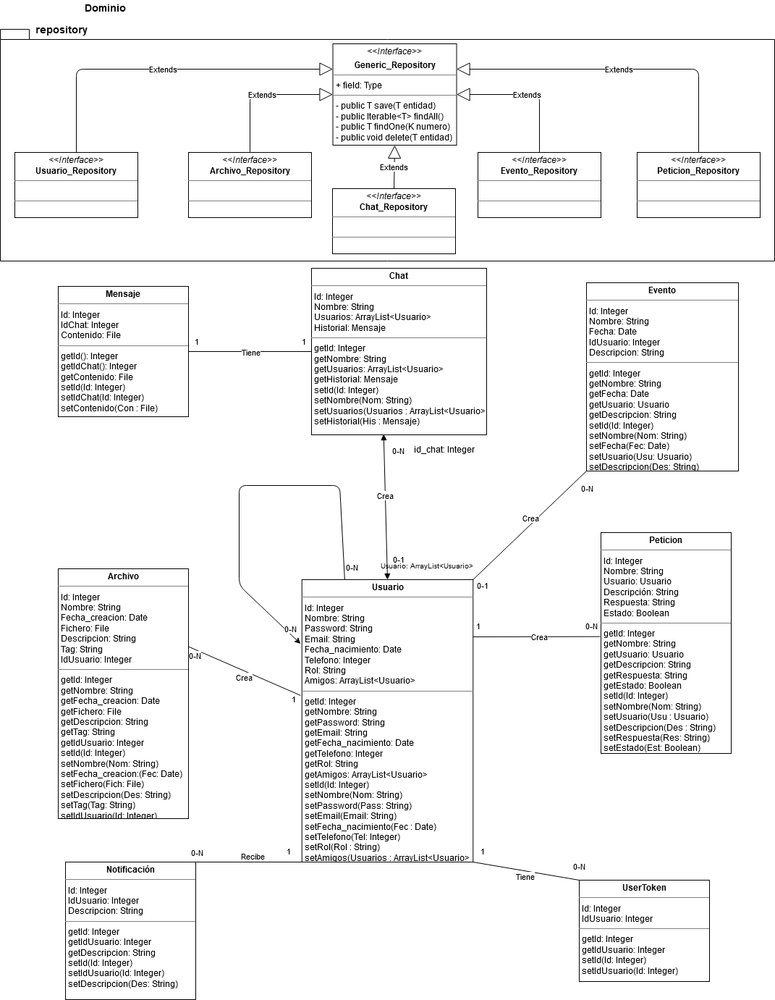

# 
PROYECTO PSP/AAD 20/21

## 
GAMER HUB

 
 

# 
Índice

> **[1. Licencia y Autores](#1)** 
> **[2. Presentación](#2)** 
> **[3. FASE 1: Análisis](#3)** 
> **[&nbsp;&nbsp;&nbsp; Actividad 1: Requisitos no funcionales](#4)** 
> **[&nbsp;&nbsp;&nbsp; Actividad 2: Requisitos funcionales. Definición del problema.](#5)** 
> **[&nbsp;&nbsp;&nbsp; Actividad 3: Entorno de trabajo.](#6)** 
> **[&nbsp;&nbsp;&nbsp; Actividad 4: Análisis de requisitos funcionales. Casos de uso.](#7)** 
> **[&nbsp;&nbsp;&nbsp;&nbsp;&nbsp;&nbsp; -Gestión de usuarios.](#USUARIOS)** 
> **[&nbsp;&nbsp;&nbsp;&nbsp;&nbsp;&nbsp; -Gestión del servidor de archivos.](#ARCHIVOS)** 
> **[&nbsp;&nbsp;&nbsp;&nbsp;&nbsp;&nbsp; -Gestión de chat.](#CHATS)** 
> **[&nbsp;&nbsp;&nbsp;&nbsp;&nbsp;&nbsp; -Gestión de eventos..](#EVENTOS)** 
> **[&nbsp;&nbsp;&nbsp;&nbsp;&nbsp;&nbsp; -Gestión de peticiones/incidencias.](#PETICIONES)** 
> **[&nbsp;&nbsp;&nbsp; Actividad 5: Modelo de objetos del negocio.](#8)** 
> **[&nbsp;&nbsp;&nbsp; Actividad 6: Interfaz gráfica.](#9)** 
 

# LICENCIA Y AUTORES

Este material ha sido producido por <b>Manuel Santos</b>, <b>Victor Ruiz</b> y <b>Miguel Rodríguez</b> bajo licencia Creative Commons.  

 

  

 

# PRESENTACIÓN

¡Hola! Somos el equipo 3, formado por los alumnos Manuel Santos, Víctor Ruiz y Miguel Rodríguez.
Somos estudiantes de 2º curso del ciclo FP superior DAM y este es un proyecto
que estamos realizando para el módulo de Programación de Servicios y Procesos con nuestro profesor José Luis Rodríguez Rodríguez y el módulo de Acceso a Datos con nuestro profesor Jesús García Rodríguez en el I.E.S Ramón del Valle Inclán.

# FASE 1: ANÁLISIS

## ACTIVIDAD 1: REQUISITOS NO FUNCIONALES.

1. Funcionalidades desarrolladas en procesos y subprocesos.

    * Procesos del SO: fecha y hora, CMD, recoger
    datos de otras aplicaciones como Spotify o Steam.
    * Procesos de la propia app: [por ver aún...]
  
2. Funcionalidades concurrentes con hilos.

    * Nuestra aplicación requerirá de hilos para la propia conexión en sí al servidor,
    al conectarse a un canal o sala de chat. En el primer caso, cada usuario conectado es un hilo,
    y las conexiones a los chats serían subhilos.
    * ... o al enviar peticiones al admin, las cuales 
    serán limitadas en un tiempo determinado (productor-consumidor). Esta última funcionalidad
    requerirá de una cola de peticiones, y sólo cuando el admin o usuario con el rol requerido
    atienda a la petición se podrá enviar otra.

3. Funcionalidades para comunicaciones en red: Arquitectura Cliente-Servidor.

    * La aplicación en sí tendrá un desarrollo por dos partes en este requisito:
      
         - La aplicación servidor, que será la encargada de recibir peticiones de los clientes, 
         la que establecerá una conexión con la base de datos. Si está parte no está operativa
         los usuarios no podrán usar la aplicación del lado del cliente. Se usará el protocolo
         TPC/IP para estas conexiones.
         
         - La aplicación cliente, que enviará la petición de conexión al servidor.
    
4. Implementación protocolos estándar de correo y ficheros: SMTP y FTP.

    * <b>FTP: </b>Servidor común de archivos (imágenes o ficheros) en los que los usuarios podrán descargar
    o subir archivos.
    
    * <b>SMTP: </b>Servidor para correos: recordatorios, envíos de peticiones, recuperación de la cuenta.

 

## ACTIVIDAD 2: REQUISITOS FUNCIONALES. DEFINICIÓN DEL PROBLEMA.

1. <b>TÍTULO: </b> GAMER HUB
2. <b>OBJETIVO: </b> Nuestro proyecto constituye una aplicación, parecida a Discord, cuyo objetivo es la comunicación entre jugadores en directo, los cuales además de chatear, podrán intercambiarse ficheros y administrar eventos que pueden crear como recordatorios. Sus características incluirán:
- Registrar una cuenta.
- Un perfil del cliente que el mismo podrá modificar a gusto propio.
- Salas de chats o canales para hablar con amigos.
- Una funcionalidad que permite enviar mensajes (peticiones o incidencias) al administrador del sistema.
- APIs: que nos proporcionarán información de nuestros amigos sobre que juego está jugando (Steam) o que están escuchando en ese mismo instante (Spotify).
- Un calendario de eventos.
- En la pantalla de iniciar sesión o registro una opción de recuperación de la cuenta si se olvidan el correo, nombre de usuario o contraseña.
- Añadir/Eliminar amigo
- Ver perfil de amigo
- Subir/Descargar/Eliminar archivos de un servidor.

 

## ACTIVIDAD 3: ENTORNO DE TRABAJO

- Lenguaje: Java.

- Entorno de Desarrollo: [IntelliJ](https://www.jetbrains.com/es-es/idea/download/#section=windows).

- SDK: [Java SE Development Kit 8.](https://www.oracle.com/es/java/technologies/javase/javase-jdk8-downloads.html)

- Control de versiones: Usaremos GitHub Classroom donde trabajaremos en 2 ramas fundamentalmente:

  - Rama main donde subiremos la parte de codificación de la aplicación.

  - Rama documentación donde subiremos el manual técnico que recogerá todo el apartado técnico de la aplicación, así como un manual de usuario explicando cómo puede acceder a nuestra aplicación.

    Cada rama tiene su rama release, que usaremos para preproducción una vez terminado el proyecto.

- Arquitectura: Usaremos 2 principalmente:

  -  [MVC](https://desarrolloweb.com/articulos/que-es-mvc.html): La aplicación de escritorio será realizada con este patrón.
  - [Arquitectura limpia por capas](https://www.genbeta.com/desarrollo/principios-de-una-arquitectura-limpia-mantenible-y-testeable)

- Maven.

- Spring.
   

## ACTIVIDAD 4: ANÁLISIS DE REQUISITOS FUNCIONALES. CASOS DE USO.

 

### <b>DIAGRAMA CASOS DE USO</b>

 

 

<table style="width:100%">
  <tr>
    <td><b>ID: </b></td>
    <td>CU-1</td>
  </tr>
  <tr>
    <td><b>Nombre: </b></td>
    <td>REGISTRO DE USUARIO</td>
  </tr>
  <tr>
  <td><b>Equipo/Individual<b></td>
  <td>Equipo</td>
  </tr>
  <tr>
    <td><b>Descripción:</b></td>
    <td>Se accede al formulario de registro al pulsar el botón “Crear cuenta”</td>
  </tr>
  <tr>
    <td><b>Actores:</b></td>
    <td>Cliente/Usuario</td>
  </tr>
  <tr>
  <td><b>Precondiciones:</b></td>
  <td>El nombre de usuario o el correo mediante los cuales vamos a crear nuestra cuenta no deben existir previamente como registrados, es decir, han de ser nuevos.</td>
  </tr>
    <tr>
  <td><b>Curso normal:</b></td>
  <td>
1.  En la pantalla inicial de login o registro, pulsamos el botón “Crear Cuenta”  
2.  Se pasa a una vista de formulario, en la que se nos pedirán datos como:  
-   	Nombre de usuario o nickname. 
-   	Nombre (Obligatorio) y apellidos (Opcional). 
-   	Fecha de nacimiento. (Obligatorio). 
-   	E-mail. (Obligatorio). 
-   	Teléfono (Opcional).  
3.  El usuario hace clic en aceptar.  
4.  El sistema verifica los datos.  
5.  La cuenta se crea satisfactoriamente.
  </td>
  </tr>
  <tr>
  <td><b>Postcondiciones:</b></td>
  <td>Acceso a la pantalla principal o “home” de la aplicación. 
  </td>
</td>
  </tr>
  <tr>
  <td><b>Alternativas/Excepciones:</b></td>
  <td>
  1.  Error de conexión  
  --------------------------------------------------------------------------- 
  3.  Error en la introducción de algún campo, algún dato no es correcto. 
  4.  No se crea la cuenta.
</td>
</table>

 

<table style="width:100%">
  <tr>
    <td><b>ID: </b></td>
    <td>CU-2</td>
  </tr>
  <tr>
    <td><b>Nombre: </b></td>
    <td>INICIAR SESION</td>
  </tr>
  <tr>
  <td><b>Equipo/Individual<b></td>
  <td>Equipo</td>
  </tr>
  <tr>
    <td><b>Descripción:</b></td>
    <td>Acceder a la cuenta de nuestro usuario.</td>
  </tr>
  <tr>
    <td><b>Actores:</b></td>
    <td>Usuario/Administrador</td>
  </tr>
  <tr>
  <td><b>Precondiciones:</b></td>
  <td>Haberse registrado y tener una cuenta.</td>
  </tr>
    <tr>
  <td><b>Curso normal:</b></td>
  <td>
 1.  Se introducen el nombre de usuario o E-mail y la contraseña, en la vista de inicio.  
 2.  El usuario clica en iniciar sesión.  
 3.  El sistema comprueba los datos de acceso.  
 4.  El usuario accede correctamente a la aplicación.
  </td>
  </tr>
  <tr>
  <td><b>Postcondiciones:</b></td>
  <td>Se accede a la vista “Home” o “Principal” 
  </td>
</td>
  </tr>
  <tr>
  <td><b>Alternativas/Excepciones:</b></td>
  <td>
 4.  Error de conexión con el server. 

		4.1.  Nombre de usuario/ E-mail o contraseñas incorrectos.
		4.2.  El nombre de usuario no existe.

</td>
</table>

 

<table style="width:100%">
  <tr>
    <td><b>ID: </b></td>
    <td>CU-3</td>
  </tr>
  <tr>
    <td><b>Nombre: </b></td>
    <td>CONSULTAR PERFIL USUARIO</td>
  </tr>
  <tr>
  <td><b>Equipo/Individual<b></td>
  <td>Equipo</td>
  </tr>
  <tr>
    <td><b>Descripción:</b></td>
    <td>Se accede a la vista de nuestro perfil, donde se nos mostrarán todos nuestros datos y la posibilidad de modificarlos/ actualizarlos.</td>
  </tr>
  <tr>
    <td><b>Actores:</b></td>
    <td>Cliente/Administrador</td>
  </tr>
  <tr>
  <td><b>Precondiciones:</b></td>
  <td>Tener una cuenta y acceder a la misma.</td>
  </tr>
    <tr>
  <td><b>Curso normal:</b></td>
  <td>
1.  En la vista del perfil, pulsamos el botón de edición adyacente al campo que queramos modificar.  
2.  Introducimos la modificación.  
3.  Se realiza la modificación correctamente.
  </td>
  </tr>
  <tr>
  <td><b>Postcondiciones:</b></td>
  <td>Se modifica nuestro perfil. 
  </td>
</td>
  </tr>
  <tr>
  <td><b>Alternativas/Excepciones:</b></td>
  <td>
 3. El tipo de dato introducido en algún campo es incorrecto, no tiene el formato correcto o es demasiado largo o corto.
</td>
</table>

 

<table style="width:100%">
  <tr>
    <td><b>ID: </b></td>
    <td>CU-4</td>
  </tr>
  <tr>
    <td><b>Nombre: </b></td>
    <td>RECUPERAR LISTA DE AMIGOS</td>
  </tr>
  <tr>
  <td><b>Equipo/Individual<b></td>
  <td>Equipo</td>
  </tr>
  <tr>
    <td><b>Descripción:</b></td>
    <td>El sistema recupera una lista de amigos.</td>
  </tr>
  <tr>
    <td><b>Actores:</b></td>
    <td>Sistema</td>
  </tr>
  <tr>
  <td><b>Precondiciones:</b></td>
  <td></td>
  </tr>
    <tr>
  <td><b>Curso normal:</b></td>
  <td>
1.  El sistema recupera la lista de amigos del usuario que accede a la gestion de amigos.  
  </td>
  </tr>
  <tr>
  <td><b>Postcondiciones:</b></td>
  <td>Se recupera la lista de amigos. 
  </td>
</td>
  </tr>
  <tr>
  <td><b>Alternativas/Excepciones:</b></td>
  <td>
Ninguna
</td>
</table>

 

<table style="width:100%">  <tr>    <td><b>ID: </b></td>    <td>CU-5</td>  </tr>  <tr>    <td><b>Nombre: </b></td>    <td>ENVIAR PETICIÓN DE AMISTAD</td>  </tr>  <tr>  <td><b>Equipo/Individual<b></td>  <td>Equipo</td>  </tr>  <tr>    <td><b>Descripción:</b></td>    <td>Se accede a una pantalla donde el usuario podrá buscar a cualquier usuario de la plataforma por su nombre/nickname y agregarlo como amigo.</td>  </tr>  <tr>    <td><b>Actores:</b></td>    <td>Usuario/Administrador</td>  </tr>  <tr>  <td><b>Precondiciones:</b></td>  <td>Tener una cuenta y acceder a la misma.</td>  </tr>    <tr>  <td><b>Curso normal:</b></td>  <td>1.  En la vista buscar amigos, el usuario introducirá el nick del amigo que quiera buscar en la barra de búsqueda.  2.  Aparecerán los usuarios del sistema que se llamen igual al puesto y el usuario podrá añadir a su amigo haciendo click en el icono de agregar.  </td>  </tr>  <tr>  <td><b>Postcondiciones:</b></td>  <td>Se actualizará la lista de amigos para chatear o insertar en un canal al usuario agregado.   </td></td>  </tr>  <tr>  <td><b>Alternativas/Excepciones:</b></td>  <td>2. No se encuentra al usuario introducido en la barra de búsqueda y el sistema notificará al usuario.</td></table>

 

<table style="width:100%">
  <tr>
    <td><b>ID: </b></td>
    <td>CU-6</td>
  </tr>
  <tr>
    <td><b>Nombre: </b></td>
    <td>GESTIONAR LISTA DE AMIGOS</td>
  </tr>
  <tr>
  <td><b>Equipo/Individual<b></td>
  <td>Equipo</td>
  </tr>
  <tr>
    <td><b>Descripción:</b></td>
    <td>El usuario accede a su lista de amigos pudiendo ver y eliminar su perfil.</td>
  </tr>
  <tr>
    <td><b>Actores:</b></td>
    <td>Cliente/Administrador</td>
  </tr>
  <tr>
  <td><b>Precondiciones:</b></td>
  <td>Tener una cuenta y acceder a la misma.</td>
  </tr>
    <tr>
  <td><b>Curso normal:</b></td>
  <td>
1.  El usuario hace clic en el amigo que quiera dentro de su lista de amigos.  
2.  Se abrirá una nueva vista con los datos del amigo.  
3.  El usuario ve los datos del amigo y tiene la opcion de realizar eliminar amigo.
  </td>
  </tr>
  <tr>
  <td><b>Postcondiciones:</b></td>
  <td>El usuario ve los amigos que tiene y accede a su perfil público.
  </td>
</td>
  </tr>
  <tr>
  <td><b>Alternativas/Excepciones:</b></td>
  <td>
Ninguna.
</td>
</table>

 

<table style="width:100%">
  <tr>
    <td><b>ID: </b></td>
    <td>CU-7</td>
  </tr>
  <tr>
    <td><b>Nombre: </b></td>
    <td>ELIMINAR AMIGO</td>
  </tr>
  <tr>
  <td><b>Equipo/Individual<b></td>
  <td>Equipo</td>
  </tr>
  <tr>
    <td><b>Descripción:</b></td>
    <td>El usuario accede a su lista de amigos y elimina un perfil.</td>
  </tr>
  <tr>
    <td><b>Actores:</b></td>
    <td>Cliente/Administrador</td>
  </tr>
  <tr>
  <td><b>Precondiciones:</b></td>
  <td>Tener una cuenta y acceder a la misma.</td>
  </tr>
    <tr>
  <td><b>Curso normal:</b></td>
  <td>
1.  Realiza GESTIONAR LISTA DE AMIGOS.
2.  El usuario hace clic en eliminar.  
3.  El sistema confirma que quiere eliminar.  
4.  El sistema elimina al amigo.
  </td>
  </tr>
  <tr>
  <td><b>Postcondiciones:</b></td>
  <td>El usuario ve los amigos que tiene y accede a su perfil público.
  </td>
</td>
  </tr>
  <tr>
  <td><b>Alternativas/Excepciones:</b></td>
  <td>
      4. El sistema no puede eliminar al amigo
      </td>
</table>

 

<table style="width:100%">
  <tr>
    <td><b>ID: </b></td>
    <td>CU-8</td>
  </tr>
  <tr>
    <td><b>Nombre: </b></td>
    <td>MODIFICAR USUARIOS</td>
  </tr>
  <tr>
  <td><b>Equipo/Individual<b></td>
  <td>Equipo</td>
  </tr>
  <tr>
    <td><b>Descripción:</b></td>
    <td>El administrador modifica los usuarios de la aplicación.</td>
  </tr>
  <tr>
    <td><b>Actores:</b></td>
    <td>Administrador</td>
  </tr>
  <tr>
  <td><b>Precondiciones:</b></td>
  <td>Ser administrador y acceder a la aplicación.</td>
  </tr>
    <tr>
  <td><b>Curso normal:</b></td>
  <td>
1.  El administrador hace clic en administrar usuarios.  
2.  Se abrirá una vista con la lista de usuarios del sistema.   
3.  El administrador hará clic en el usuario deseado y hace clic en modificar usuario.  
3.  El administrador modifica los campos deseados y hace clic en aceptar.  
4.  Se realiza la modificación correctamente.
  </td>
  </tr>
  <tr>
  <td><b>Postcondiciones:</b></td>
  <td>Se modifica el usuario deseado por el administrador.
  </td>
</td>
  </tr>
  <tr>
  <td><b>Alternativas/Excepciones:</b></td>
  <td>
4. El tipo de dato introducido en algún campo al modificar el perfil es incorrecto, no tiene el formato correcto o es demasiado largo o corto.
</td>
</table>

 

<table style="width:100%">
  <tr>
    <td><b>ID: </b></td>
    <td>CU-9</td>
  </tr>
  <tr>
    <td><b>Nombre: </b></td>
    <td>SUSPENDER USUARIOS</td>
  </tr>
  <tr>
  <td><b>Equipo/Individual<b></td>
  <td>Equipo</td>
  </tr>
  <tr>
    <td><b>Descripción:</b></td>
    <td>El administrador suspende temporalmente a usuarios de la aplicación.</td>
  </tr>
  <tr>
    <td><b>Actores:</b></td>
    <td>Administrador</td>
  </tr>
  <tr>
  <td><b>Precondiciones:</b></td>
  <td>Ser administrador y acceder a la aplicación.</td>
  </tr>
    <tr>
  <td><b>Curso normal:</b></td>
  <td>
1.  El administrador hace clic en administrar usuarios.  
2.  Se abrirá una vista con la lista de usuarios del sistema.   
3.  el administrador hará clic en el usuario deseado y hará clic en suspender temporalmente.  
4.  Se realiza la suspensión correctamente.
  </td>
  </tr>
  <tr>
  <td><b>Postcondiciones:</b></td>
  <td>Se suspende temporalmente al usuario deseado por el administrador.
  </td>
</td>
  </tr>
  <tr>
  <td><b>Alternativas/Excepciones:</b></td>
  <td>
Ninguna.
</td>
</table>

 

<table style="width:100%">
  <tr>
    <td><b>ID: </b></td>
    <td>CU-10</td>
  </tr>
  <tr>
    <td><b>Nombre: </b></td>
    <td>ELIMINAR USUARIOS</td>
  </tr>
  <tr>
  <td><b>Equipo/Individual<b></td>
  <td>Equipo</td>
  </tr>
  <tr>
    <td><b>Descripción:</b></td>
    <td>El administrador elimina a un usuario de la aplicación.</td>
  </tr>
  <tr>
    <td><b>Actores:</b></td>
    <td>Administrador</td>
  </tr>
  <tr>
  <td><b>Precondiciones:</b></td>
  <td>Ser administrador y acceder a la aplicación.</td>
  </tr>
    <tr>
  <td><b>Curso normal:</b></td>
  <td>
1.  El administrador hace clic en administrar usuarios.  
2.  Se abrirá una vista con la lista de usuarios del sistema.   
3.  el administrador hará clic en el usuario deseado y hace clic en eliminar.  
4.  Se realiza la eliminación correctamente.
  </td>
  </tr>
  <tr>
  <td><b>Postcondiciones:</b></td>
  <td>Se administra el usuario deseado por el administrador.
  </td>
</td>
  </tr>
  <tr>
  <td><b>Alternativas/Excepciones:</b></td>
  <td>
Ninguna.
</td>
</table>

 

 

<table style="width:100%">
  <tr>
    <td><b>ID: </b></td>
    <td>CU-11</td>
  </tr>
  <tr>
    <td><b>Nombre: </b></td>
    <td>SUBIR ARCHIVOS</td>
  </tr>
  <tr>
  <td><b>Equipo/Individual<b></td>
  <td>Víctor</td>
  </tr>
  <tr>
    <td><b>Descripción:</b></td>
    <td>El usuario sube un archivo que podra descargar cualquier usuario de la plataforma. </td>
  </tr>
  <tr>
    <td><b>Actores:</b></td>
    <td>Usuario/Administrador</td>
  </tr>
  <tr>
  <td><b>Precondiciones:</b></td>
  <td>Tener una cuenta y acceder a la misma.</td>
  </tr>
    <tr>
  <td><b>Curso normal:</b></td>
  <td>
1.  En la vista principal, el usuario hará clic en subir archivo.  
2.  Se abrira una pequeña ventana donde se especificará la ruta del archivo.  
3.  El archivo se subirá al servidor.  
  </td>
  </tr>
  <tr>
  <td><b>Postcondiciones:</b></td>
  <td>El usuario consigue subir el archivo al servidor para los demas usuarios. 
  </td>
</td>
  </tr>
  <tr>
  <td><b>Alternativas/Excepciones:</b></td>
  <td>
3.1 Ocurre un error en la conexion.  
3.2 No es posible subir el archivo debido a su tamaño.
</td>
</table>

 

<table style="width:100%">
  <tr>
    <td><b>ID: </b></td>
    <td>CU-12</td>
  </tr>
  <tr>
    <td><b>Nombre: </b></td>
    <td>BAJAR ARCHIVOS</td>
  </tr>
  <tr>
  <td><b>Equipo/Individual<b></td>
  <td>Víctor</td>
  </tr>
  <tr>
    <td><b>Descripción:</b></td>
    <td>Se accede a la pantalla de ficheros donde el usuario podrá ver y descargar un archivo del servidor.</td>
  </tr>
  <tr>
    <td><b>Actores:</b></td>
    <td>Usuario/Administrador</td>
  </tr>
  <tr>
  <td><b>Precondiciones:</b></td>
  <td>Tener una cuenta y acceder a la misma.</td>
  </tr>
    <tr>
  <td><b>Curso normal:</b></td>
  <td>
1.  En la vista principal, el usuario hará clic en ver archivos.  
2.  Se abrirá una nueva pantalla donde podrá ver los archivos subidos.  
3.  El usuario hará clic en descargar en el archivo deseado.  
4.  El archivo se descargará correctamente.  
  </td>
  </tr>
  <tr>
  <td><b>Postcondiciones:</b></td>
  <td>El usuario consigue subir el archivo al servidor para los demas usuarios. 
  </td>
</td>
  </tr>
  <tr>
  <td><b>Alternativas/Excepciones:</b></td>
  <td>
4.1 Ocurre un error en la conexion.  
4.2 No es posible descargar el archivo debido a que está dañado.
</td>
</table>

 

<table style="width:100%">
  <tr>
    <td><b>ID: </b></td>
    <td>CU-13</td>
  </tr>
  <tr>
    <td><b>Nombre: </b></td>
    <td>ELIMINAR ARCHIVOS</td>
  </tr>
  <tr>
  <td><b>Equipo/Individual<b></td>
  <td>Víctor</td>
  </tr>
  <tr>
    <td><b>Descripción:</b></td>
    <td>Se accede a la pantalla de ficheros donde el usuario podrá ver y eliminar un archivo suyo del servidor.</td>
  </tr>
  <tr>
    <td><b>Actores:</b></td>
    <td>Usuario/Administrador</td>
  </tr>
  <tr>
  <td><b>Precondiciones:</b></td>
  <td>Tener una cuenta, acceder a la misma y ser dueño del archivo subido.</td>
  </tr>
    <tr>
  <td><b>Curso normal:</b></td>
  <td>
1.  En la vista principal, el usuario hará clic en ver archivos.  
2.  Se abrirá una nueva pantalla donde podrá ver los archivos subidos.  
3.  El usuario hará clic en eliminar en el archivo deseado.  
4.  El archivo se eliminará correctamente.  
  </td>
  </tr>
  <tr>
  <td><b>Postcondiciones:</b></td>
  <td>El usuario consigue eliminar el archivo del servidor. 
  </td>
</td>
  </tr>
  <tr>
  <td><b>Alternativas/Excepciones:</b></td>
  <td>
4.1 Ocurre un error en la conexion.  
4.2 No es posible eliminar el archivo debido a que no ha sido subido por él.
</td>
</table>

 

 

<table style="width:100%">
  <tr>
    <td><b>ID: </b></td>
    <td>CU-14</td>
  </tr>
  <tr>
    <td><b>Nombre: </b></td>
    <td>CREAR CHAT</td>
  </tr>
  <tr>
  <td><b>Equipo/Individual<b></td>
  <td>Víctor</td>
  </tr>
  <tr>
    <td><b>Descripción:</b></td>
    <td>Se accede a la vista de creación de chat donde se seleccionará un nombre y se agregaran a los amigos que quiera y tenga el usuario.</td>
  </tr>
  <tr>
    <td><b>Actores:</b></td>
    <td>Cliente/Administrador</td>
  </tr>
  <tr>
  <td><b>Precondiciones:</b></td>
  <td>Tener una cuenta, acceder a la misma y tener agregados usuarios como amigos.</td>
  </tr>
    <tr>
  <td><b>Curso normal:</b></td>
  <td>
1.  El usuario hace clic en crear chat.  
2.  Se abre una nueva vista que pide al usuario que introduzca un nombre del canal y que introduzca a los amigos que quiera agregar al canal.  
3.  El usuario introduce los datos.  
4.  El sistema crea el chat con las personas seleccionadas por el usuario y la añade a la vista de chats.
  </td>
  </tr>
  <tr>
  <td><b>Postcondiciones:</b></td>
  <td>El usuario crea el chat para chatear correctamente.
  </td>
</td>
  </tr>
  <tr>
  <td><b>Alternativas/Excepciones:</b></td>
  <td>
Ninguna.
</td>
</table>

 

<table style="width:100%">
  <tr>
    <td><b>ID: </b></td>
    <td>CU-15</td>
  </tr>
  <tr>
    <td><b>Nombre: </b></td>
    <td>UNIRSE A UN CHAT</td>
  </tr>
  <tr>
  <td><b>Equipo/Individual<b></td>
  <td>Víctor</td>
  </tr>
  <tr>
    <td><b>Descripción:</b></td>
    <td>Se accede a la vista de chat eligiendo el chat correspondiente.</td>
  </tr>
  <tr>
    <td><b>Actores:</b></td>
    <td>Cliente/Administrador</td>
  </tr>
  <tr>
  <td><b>Precondiciones:</b></td>
  <td>Tener una cuenta, acceder a la misma.</td>
  </tr>
    <tr>
  <td><b>Curso normal:</b></td>
  <td>
1.  En la lista de chats estando en la vista principal, el usuario selecciona el que quiera.  
2.  Se abre la vista chat con la conversación anterior si hubiera.  
  </td>
  </tr>
  <tr>
  <td><b>Postcondiciones:</b></td>
  <td>El usuario se une al chat.
  </td>
</td>
  </tr>
  <tr>
  <td><b>Alternativas/Excepciones:</b></td>
  <td>
2. No pudo abrirse la vista chat, se especifica el error al usuario.
</td>
</table>

 

<table style="width:100%">
  <tr>
    <td><b>ID: </b></td>
    <td>CU-16</td>
  </tr>
  <tr>
    <td><b>Nombre: </b></td>
    <td>ENVIAR/RECIBIR MENSAJES</td>
  </tr>
  <tr>
  <td><b>Equipo/Individual<b></td>
  <td>Víctor</td>
  </tr>
  <tr>
    <td><b>Descripción:</b></td>
    <td>Desde la vista chat, el usuario envia y recibe mensajes.</td>
  </tr>
  <tr>
    <td><b>Actores:</b></td>
    <td>Cliente/Administrador</td>
  </tr>
  <tr>
  <td><b>Precondiciones:</b></td>
  <td>Tener una cuenta, acceder a la misma y haberse unido a un chat previamente.</td>
  </tr>
    <tr>
  <td><b>Curso normal:</b></td>
  <td>
1. El usuario introduce el mensaje en la barra de mensajes y lo envía pulsando el botón de enviar.  
2.  El sistema envía el mensaje al chat.  
3.  Se envía satisfactoriamente el mensaje.
  </td>
  </tr>
  <tr>
  <td><b>Postcondiciones:</b></td>
  <td>El usuario chatea con otro usuario o en un grupo.
  </td>
</td>
  </tr>
  <tr>
  <td><b>Alternativas/Excepciones:</b></td>
  <td>
3. El mensaje no puede enviarse y el sistema notifica al usuario.
</td>
</table>

 

<table style="width:100%">
  <tr>
    <td><b>ID: </b></td>
    <td>CU-17</td>
  </tr>
  <tr>
    <td><b>Nombre: </b></td>
    <td>ABANDONAR CHAT</td>
  </tr>
  <tr>
  <td><b>Equipo/Individual<b></td>
  <td>Manuel</td>
  </tr>
  <tr>
    <td><b>Descripción:</b></td>
    <td>El usuario abandona el chat que quiera.</td>
  </tr>
  <tr>
    <td><b>Actores:</b></td>
    <td>Cliente/Administrador</td>
  </tr>
  <tr>
  <td><b>Precondiciones:</b></td>
  <td>Tener una cuenta, acceder a la misma.</td>
  </tr>
    <tr>
  <td><b>Curso normal:</b></td>
  <td>
1.  En la lista de chats estando en la vista principal, el usuario selecciona el que quiera.  
2.  Una vez abierto el chat, el usuario hace clic en abandonar chat.  
3.  El sistema elimina al usuario del chat.
  </td>
  </tr>
  <tr>
  <td><b>Postcondiciones:</b></td>
  <td>El usuario abandona el chat.
  </td>
</td>
  </tr>
  <tr>
  <td><b>Alternativas/Excepciones:</b></td>
  <td>
3. Error del sistema al echar al usuario.
</td>
</table>

 

<table style="width:100%">
  <tr>
    <td><b>ID: </b></td>
    <td>CU-18</td>
  </tr>
  <tr>
    <td><b>Nombre: </b></td>
    <td>ELIMINAR CHAT</td>
  </tr>
  <tr>
  <td><b>Equipo/Individual<b></td>
  <td>Manuel</td>
  </tr>
  <tr>
    <td><b>Descripción:</b></td>
    <td>El usuario elimina un chat que creó previamente.</td>
  </tr>
  <tr>
    <td><b>Actores:</b></td>
    <td>Cliente/Administrador</td>
  </tr>
  <tr>
  <td><b>Precondiciones:</b></td>
  <td>Tener una cuenta, acceder a la misma y haber creado una cuenta.</td>
  </tr>
    <tr>
  <td><b>Curso normal:</b></td>
  <td>
1.  En la lista de chats estando en la vista principal, el usuario selecciona el que quiera.  
2.  Una vez abierto el chat, el usuario hace clic en eliminar chat.  
3.  El sistema comprueba que el usuario es el creador del chat.  
3.  El sistema elimina el chat.
  </td>
  </tr>
  <tr>
  <td><b>Postcondiciones:</b></td>
  <td>El usuario elimina el chat.
  </td>
</td>
  </tr>
  <tr>
  <td><b>Alternativas/Excepciones:</b></td>
  <td>
4. Error al eliminar el chat, el usuario no es el creador del chat.
</td>
</table>

 

<table style="width:100%">
  <tr>
    <td><b>ID: </b></td>
    <td>CU-19</td>
  </tr>
  <tr>
    <td><b>Nombre: </b></td>
    <td>MODIFICAR CHAT</td>
  </tr>
  <tr>
  <td><b>Equipo/Individual<b></td>
  <td>Manuel</td>
  </tr>
  <tr>
    <td><b>Descripción:</b></td>
    <td>El administrador modifica mensajes y elimina cualquier chat.</td>
  </tr>
  <tr>
    <td><b>Actores:</b></td>
    <td>Administrador</td>
  </tr>
  <tr>
  <td><b>Precondiciones:</b></td>
  <td>Tener una cuenta y acceder a la misma.</td>
  </tr>
    <tr>
  <td><b>Curso normal:</b></td>
  <td>
1.  El administrador hace clic en el chat que desee en la vista principal de la aplicación.  
2.  El administrador gestiona el chat modificando lo que vea conveniente..  
  </td>
  </tr>
  <tr>
  <td><b>Postcondiciones:</b></td>
  <td>El administrador gestiona un chat.
  </td>
</td>
  </tr>
  <tr>
  <td><b>Alternativas/Excepciones:</b></td>
  <td>
Ninguna.
</td>
</table>

 

<table style="width:100%">
  <tr>
    <td><b>ID: </b></td>
    <td>CU-20</td>
  </tr>
  <tr>
    <td><b>Nombre: </b></td>
    <td>CONSULTAR CHATS</td>
  </tr>
  <tr>
  <td><b>Equipo/Individual<b></td>
  <td>Manuel</td>
  </tr>
  <tr>
    <td><b>Descripción:</b></td>
    <td>El usuario consulta los chats ya creados.</td>
  </tr>
  <tr>
    <td><b>Actores:</b></td>
    <td>Usuario/Administrador</td>
  </tr>
  <tr>
  <td><b>Precondiciones:</b></td>
  <td>Tener una cuenta y acceder a la misma.</td>
  </tr>
    <tr>
  <td><b>Curso normal:</b></td>
  <td>
1.  El usuario hace clic en consultar chats en la vista principal de la aplicación.  
2.  El sistema devuelve la lista de chats disponibles.  
  </td>
  </tr>
  <tr>
  <td><b>Postcondiciones:</b></td>
  <td>El usuario consulta los chats.
  </td>
</td>
  </tr>
  <tr>
  <td><b>Alternativas/Excepciones:</b></td>
  <td>
Ninguna.
</td>
</table>

 

<table style="width:100%">
  <tr>
    <td><b>ID: </b></td>
    <td>CU-21</td>
  </tr>
  <tr>
    <td><b>Nombre: </b></td>
    <td>DAR DE ALTA UN EVENTO</td>
  </tr>
  <tr>
  <td><b>Equipo/Individual<b></td>
  <td>Manuel</td>
  </tr>
  <tr>
    <td><b>Descripción:</b></td>
    <td>El usuario crea un evento.</td>
  </tr>
  <tr>
    <td><b>Actores:</b></td>
    <td>Cliente/Administrador</td>
  </tr>
  <tr>
  <td><b>Precondiciones:</b></td>
  <td>Tener una cuenta y acceder a la misma.</td>
  </tr>
    <tr>
  <td><b>Curso normal:</b></td>
  <td>
1.  El usuario hace clic en el icono "+" para agregar un evento a su lista.  
2.  Se abrirá una nueva vista con los datos a introducir del evento y la fecha.  
3.  El usuario introduce los datos en sus respectivos campos.  
4. El evento se agregará correctamente.
  </td>
  </tr>
  <tr>
  <td><b>Postcondiciones:</b></td>
  <td>El usuario agrega un evento correctamente.
  </td>
</td>
  </tr>
  <tr>
  <td><b>Alternativas/Excepciones:</b></td>
  <td>
4. Error al introducir algún campo.
</td>
</table>

 

<table style="width:100%">
  <tr>
    <td><b>ID: </b></td>
    <td>CU-22</td>
  </tr>
  <tr>
    <td><b>Nombre: </b></td>
    <td>ELIMINAR UN EVENTO</td>
  </tr>
  <tr>
  <td><b>Equipo/Individual<b></td>
  <td>Manuel</td>
  </tr>
  <tr>
    <td><b>Descripción:</b></td>
    <td>El usuario elimina un evento.</td>
  </tr>
  <tr>
    <td><b>Actores:</b></td>
    <td>Cliente/Administrador</td>
  </tr>
  <tr>
  <td><b>Precondiciones:</b></td>
  <td>Tener una cuenta y acceder a la misma.</td>
  </tr>
    <tr>
  <td><b>Curso normal:</b></td>
  <td>
1.  Realiza Consultar eventos.  
2.  El usuario selecciona un evento en la vista de eventos.  
3.  El usuario hace clic en eliminar evento.  
4.  El evento se eliminará correctamente
  </td>
  </tr>
  <tr>
  <td><b>Postcondiciones:</b></td>
  <td>El usuario elimina un evento correctamente.
  </td>
</td>
  </tr>
  <tr>
  <td><b>Alternativas/Excepciones:</b></td>
  <td>
3. Error del sistema al eliminar un evento.
</td>
</table>

 

<table style="width:100%">
  <tr>
    <td><b>ID: </b></td>
    <td>CU-23</td>
  </tr>
  <tr>
    <td><b>Nombre: </b></td>
    <td>CONSULTAR EVENTOS</td>
  </tr>
  <tr>
  <td><b>Equipo/Individual<b></td>
  <td>Manuel</td>
  </tr>
  <tr>
    <td><b>Descripción:</b></td>
    <td>El usuario consulta los datos de los eventos.</td>
  </tr>
  <tr>
    <td><b>Actores:</b></td>
    <td>Cliente/Administrador</td>
  </tr>
  <tr>
  <td><b>Precondiciones:</b></td>
  <td>Tener una cuenta y acceder a la misma.</td>
  </tr>
    <tr>
  <td><b>Curso normal:</b></td>
  <td>
1.  El usuario hace clic en cosultar eventos.   
2.  Se le devuelve una lista con los eventos creados por el usuario.  
  </td>
  </tr>
  <tr>
  <td><b>Postcondiciones:</b></td>
  <td>El usuario consulta un evento correctamente.
  </td>
</td>
  </tr>
  <tr>
  <td><b>Alternativas/Excepciones:</b></td>
  <td>
Ninguna.
</td>
</table>

 

<table style="width:100%">
  <tr>
    <td><b>ID: </b></td>
    <td>CU-24</td>
  </tr>
  <tr>
    <td><b>Nombre: </b></td>
    <td>MODIFICAR EVENTO</td>
  </tr>
  <tr>
  <td><b>Equipo/Individual<b></td>
  <td>Miguel</td>
  </tr>
  <tr>
    <td><b>Descripción:</b></td>
    <td>El usuario modifica los datos de un evento.</td>
  </tr>
  <tr>
    <td><b>Actores:</b></td>
    <td>Cliente/Administrador</td>
  </tr>
  <tr>
  <td><b>Precondiciones:</b></td>
  <td>Tener una cuenta y acceder a la misma.</td>
  </tr>
    <tr>
  <td><b>Curso normal:</b></td>
  <td>
1.  Realiza Consultar eventos.  
2.  El usuario hace clic en el evento que quiera de la vista de eventos.   
3.  Se abrirá una ventana con los datos del evento.  
4.  El usuario hace clic en modificar evento.
5.  El usuario introduce los datos en sus respectivos campos.  
6.  El evento se modificará correctamente.
  </td>
  </tr>
  <tr>
  <td><b>Postcondiciones:</b></td>
  <td>El usuario modifica un evento correctamente.
  </td>
</td>
  </tr>
  <tr>
  <td><b>Alternativas/Excepciones:</b></td>
  <td>
5. Error al introducir algún campo.
</td>
</table>

 

 

<table style="width:100%">
  <tr>
    <td><b>ID: </b></td>
    <td>CU-25</td>
  </tr>
  <tr>
    <td><b>Nombre: </b></td>
    <td>ENVIAR UNA PETICIÓN AL ADMINISTRADOR</td>
  </tr>
  <tr>
  <td><b>Equipo/Individual<b></td>
  <td>Miguel</td>
  </tr>
  <tr>
    <td><b>Descripción:</b></td>
    <td>El usuario manda un mensaje de incidencia o petición al administrador.</td>
  </tr>
  <tr>
    <td><b>Actores:</b></td>
    <td>Cliente/Usuario</td>
  </tr>
  <tr>
  <td><b>Precondiciones:</b></td>
  <td>Tener una cuenta y acceder a la misma.</td>
  </tr>
    <tr>
  <td><b>Curso normal:</b></td>
  <td>
1.  El usuario hace clic en ayuda en la vista principal de la aplicación.  
2.  Se abrirá una nueva vista en la que se le pedirá que indique su problema o petición y detalle el mismo.  
3.  El usuario introduce los datos.  
4.  El sistema envía la petición a la base de datos donde se guardará.
  </td>
  </tr>
  <tr>
  <td><b>Postcondiciones:</b></td>
  <td>El mensaje de incidencia se envía correctamente al administrador.
  </td>
</td>
  </tr>
  <tr>
  <td><b>Alternativas/Excepciones:</b></td>
  <td>
5.1 El sistema notifica al usuario que no se ha podido enviar la incidencia y que lo intente más tarde.
5.2 El sistema notifica que ha alcanzado el cupo de peticiones al dia que puede enviar.
</td>
</table>

 

<table style="width:100%">
  <tr>
    <td><b>ID: </b></td>
    <td>CU-26</td>
  </tr>
  <tr>
    <td><b>Nombre: </b></td>
    <td>CONSULTAR PETICIONES ENVIADAS</td>
  </tr>
  <tr>
  <td><b>Equipo/Individual<b></td>
  <td>Miguel</td>
  </tr>
  <tr>
    <td><b>Descripción:</b></td>
    <td>El usuario consulta las peticiones enviadas al administrador y su estado.</td>
  </tr>
  <tr>
    <td><b>Actores:</b></td>
    <td>Cliente/Usuario</td>
  </tr>
  <tr>
  <td><b>Precondiciones:</b></td>
  <td>Tener una cuenta y acceder a la misma.</td>
  </tr>
    <tr>
  <td><b>Curso normal:</b></td>
  <td>
1.  El usuario hace clic en ver peticiones/incidencias enviadas en la vista principal de la aplicación.  
2.  Se abrirá una nueva vista en la que se le mostrará las peticiones enviadas previamente y su estado.  
  </td>
  </tr>
  <tr>
  <td><b>Postcondiciones:</b></td>
  <td>El usuario ve las incidencias correctamente.
  </td>
</td>
  </tr>
  <tr>
  <td><b>Alternativas/Excepciones:</b></td>
  <td>
Ninguna.
</td>
</table>

 

<table style="width:100%">
  <tr>
    <td><b>ID: </b></td>
    <td>CU-27</td>
  </tr>
  <tr>
    <td><b>Nombre: </b></td>
    <td>CONSULTAR PETICIONES RECIBIDAS</td>
  </tr>
  <tr>
  <td><b>Equipo/Individual<b></td>
  <td>Miguel</td>
  </tr>
  <tr>
    <td><b>Descripción:</b></td>
    <td>El administrador consulta las peticiones recibidas de los usuarios.</td>
  </tr>
  <tr>
    <td><b>Actores:</b></td>
    <td>Administrador</td>
  </tr>
  <tr>
  <td><b>Precondiciones:</b></td>
  <td>Tener una cuenta y acceder a la misma.</td>
  </tr>
    <tr>
  <td><b>Curso normal:</b></td>
  <td>
1.  El administrador hace clic en ver peticiones/incidencias recibidas en la vista principal de la aplicación.  
2.  Se abrirá una nueva vista en la que se le mostrará las peticiones recibidas.  
  </td>
  </tr>
  <tr>
  <td><b>Postcondiciones:</b></td>
  <td>El administrador ve las peticiones recibidas.
  </td>
</td>
  </tr>
  <tr>
  <td><b>Alternativas/Excepciones:</b></td>
  <td>
Ninguna.
</td>
</table>

 

<table style="width:100%">
  <tr>
    <td><b>ID: </b></td>
    <td>CU-28</td>
  </tr>
  <tr>
    <td><b>Nombre: </b></td>
    <td>ENVIAR UNA RESPUESTA A LA PETICION</td>
  </tr>
  <tr>
  <td><b>Equipo/Individual<b></td>
  <td>Miguel</td>
  </tr>
  <tr>
    <td><b>Descripción:</b></td>
    <td>El administrador responde las peticiones recibidas de los usuarios.</td>
  </tr>
  <tr>
    <td><b>Actores:</b></td>
    <td>Administrador</td>
  </tr>
  <tr>
  <td><b>Precondiciones:</b></td>
  <td>Tener una cuenta y acceder a la misma.</td>
  </tr>
    <tr>
  <td><b>Curso normal:</b></td>
  <td>
1.  El administrador hace clic en ver peticiones/incidencias recibidas en la vista principal de la aplicación.  
2.  Se abrirá una nueva vista en la que se le mostrará las peticiones recibidas.  
3. El administrador selecciona responder.  
4. Se abrira una pequeña ventana donde podrá escribir un mensaje que recibirá el usuario de la peticion.  
5. El mensaje se envia correctamente.
  </td>
  </tr>
  <tr>
  <td><b>Postcondiciones:</b></td>
  <td>El administrador envia una respuesta a las peticiones de los usuarios.
  </td>
</td>
  </tr>
  <tr>
  <td><b>Alternativas/Excepciones:</b></td>
  <td>
Ninguna.
</td>
</table>

 

<table style="width:100%">
  <tr>
    <td><b>ID: </b></td>
    <td>CU-29</td>
  </tr>
  <tr>
    <td><b>Nombre: </b></td>
    <td>ELIMINAR PETICION</td>
  </tr>
  <tr>
  <td><b>Equipo/Individual<b></td>
  <td>Miguel</td>
  </tr>
  <tr>
    <td><b>Descripción:</b></td>
    <td>El administrador elimina las peticiones recibidas de los usuarios.</td>
  </tr>
  <tr>
    <td><b>Actores:</b></td>
    <td>Administrador</td>
  </tr>
  <tr>
  <td><b>Precondiciones:</b></td>
  <td>Tener una cuenta y acceder a la misma.</td>
  </tr>
    <tr>
  <td><b>Curso normal:</b></td>
  <td>
1.  El administrador hace clic en ver peticiones/incidencias recibidas en la vista principal de la aplicación.  
2.  Se abrirá una nueva vista en la que se le mostrará las peticiones recibidas.  
3. El administrador selecciona eliminar.  
5. La peticion se elimina correctamente y el sistema le pasa el estado concluido al usuario.
  </td>
  </tr>
  <tr>
  <td><b>Postcondiciones:</b></td>
  <td>El administrador elimina las peticiones de los usuarios.
  </td>
</td>
  </tr>
  <tr>
  <td><b>Alternativas/Excepciones:</b></td>
  <td>
Ninguna.
</td>
</table>

## ACTIVIDAD 5: MODELO DE OBJETOS DEL NEGOCIO.

 

### Diagrama de clases

#### Diagrama de clase del modelo del servidor

#### Diagrama de clase de la vista de escritorio

 

#### Diagrama Controladores

### Descripción del diagrama de clases
 
#### Plantilla clases
 

<table>

<tr>
<td>  Nombre de la clase  </td>
<td>Chat</td>	
</tr>

<tr>
<td>  Descripción  </td>
<td>En esta tabla se registrarán los usuarios los cuales participan en dicho chat y se le adjudicará el historial de mensajes que será de tipo mensaje</td>
</tr>

<tr> 
<td> Relaciones </td>
<td>Tendrá relación 1-1 con Mensaje y 0N-01 con Usuario	</td>
</tr>
	
<tr>
<td>  Atributos  </td>
<td>Id/Nombre/Usuarios/Historial</td>	
</tr>

<tr>
<td>  Atributos propios de la clase  </td>
<td>Id/Nombre</td>
</tr>

<tr> 
<td> Atributos propios de la relación </td>
<td>Usuarios/Historial</td>
</tr>

<tr>
<td>  Métodos  </td>
<td>  Getters y Setter  </td>	
</tr>

<tr>
<td>  Función  </td>
<td>   Devolver y establecer valores de los atributos</td>
</tr>	
</table>

 

### Modelo de datos 

 

## ACTIVIDAD 6: INTERFAZ GRÁFICA.

### Interfaz WEB con ADOBE XD
 

  

### Interfaz ESCRITORIO con Scene Builder
#### Vista inicio

#### Vista home

#### Vista perfil

#### Vista registro

#### Vista evento

#### Vista ayuda

